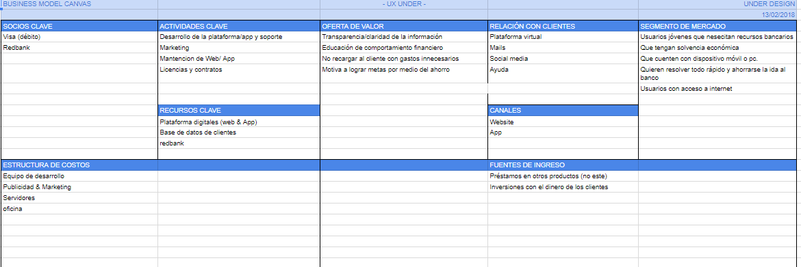
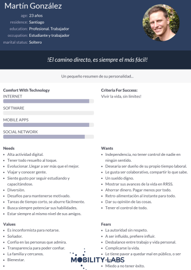
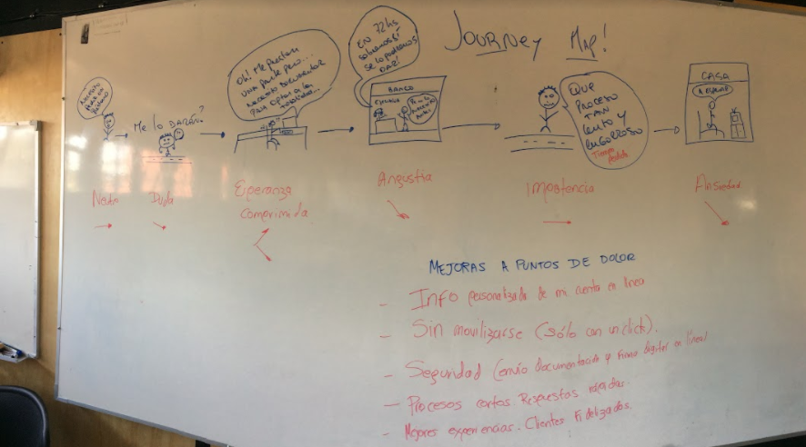
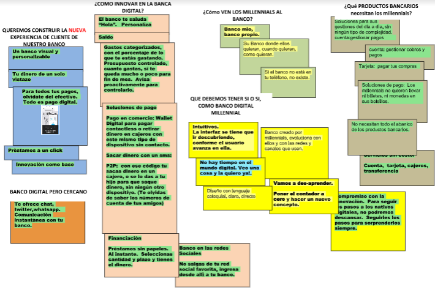
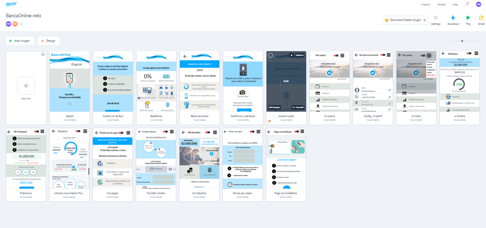

Proyecto Banco del Pais

Banco del Pais es una app bancaria que ayuda al usuario a realizar sus transacciones más importante mediante su smartphone. 

Desarrollado para
--------------------------------------------------------------------------------
 Laboratoria

Descubrimiento e investigación:

- Planeamiento:

Presentación de Kick Off y conversaciones en el equipo para poder analizar cuáles serían las metodologías a usar para el reto asignado.

- Investigacion previa sobre el modelo de negocios 

Identificamos a nuestros STAKEHOLDERS :

- CEO (Director General)
- Gerente de Riesgos
- Jefe/Gerente de Producto
- Sponsor
- Gerente de TI
- Product Owner
- Arquitecto de Software
- Data scientist
- Data engenieer
- UX Researcher
- UX Designer

RESEARCH
---------

1-Conociendo a la persona : Se realiza preguntas abiertas para conocer cual es el perfil del usuario. Seguido a conocer al usuario, preguntas sobre nuestra investigacion.
2-Arquetipo de Persona: Según los resultados de las entrevistas.
3-Paints points: Conocer los dolores más grandes para el millenial en cuanto a acudiar al Banco.
4- Entendiendo el problema.

1-
Buenos dìas, me llamo ---------------------- estamos acà, para hacer una investigación relacionada con ---------------------- . Te haré algunas preguntas, lo importante es que no te estamos evaluando a ti, sino como es tu comportamiento respecto al tema.  Por eso nos ayudas bastante si tus respuestas son lo màs sinceras posibles.  No te cohìbas.  No hay respuestas buenas ni malas.  Queremos que te sientas libre y en confianza para hablar. Si tienes dudas o comentarios que quieras hacer, seràn siempre bien recibidos, y, si por algùn motivo no deseas seguir con la entrevista, puedes avisarme y la dejamos hasta donde quedemos.

¿Empezamos?

Preguntas iniciales para conocer a quien entrevistamos:

A- Nombre.  
b- Edad.  
c- Zona en la que vive.  
d- Qué redes sociales usa y por qué?  
e- Qué haces en tu tiempo libre?  

1-Cómo es un día típico  para ti? 
2-En un día típico, para qué usas Internet? 
3-Cómo es tu relación con los bancos, eres cliente de alguno?.
4-Que tan seguido vas al banco?
5-Cuánto tiempo del día te toma revisar tu cuenta bancaria? cada cuanto y desde donde lo hiciste la ùltima vez?
6-Qué es lo que más te gusta de cuando visitas tu banco on line? 
7-Algo que te haya disgustado mucho alguna vez, cuando visitaste tu banco online?.
8-Que cosas de la atención de tu banco mejorarías?.
9-Cuando tienes algún problema con tu banco, a quién acudes para resolverlo, o, que haces?.
10-Cómo afecta a tu vida o a tu trabajo, cuando algo sale mal con tu banco?.
11-Qué otras operaciones de tu banco, usas?.
12-Cómo te ha ido con esas operaciones?.
13-Generalmente, en un día normal, cuando vas a  comprar, usas efectivo o tarjeta bancaria?
14-Qué es lo que más te gusta de usar ese medio de pago?
15-Alguna vez tu Banco te ha limitado en algo?. Cómo te sentiste esa vez?
16-De qué forma sientes que tu Banco te ayuda a manejar tu dinero?
17-Porque sientes confianza dejando tu dinero en ese Banco?
18-De tu teléfono,  cuáles son las apps que más usas?.
19-Què tan seguido las usas?

Preguntas especìficas sobre su relaciòn con la banca:

20-Eres cliente de algún banco en este momento y estas satisfecho?.
21-Si dice SI, hace cuánto eres cliente de ese banco?
22-Que esperabas antes de ser cliente de ese Banco?
23-Por qué escogiste ese banco y no otro?
24-Qué es lo más te gusta de ese banco?
25-Qué es lo que no te gusta de ese Banco?
26-Cuando escogiste ese banco, que querías de él, cuáles eran tus expectativas?.
27-Se han cumplido esas expectativas?.
28-Si no se han cumplido, qué podría mejorar el banco,  para cumplirlas?.
28-Antes de ser cliente de este Banco, eras cliente de otro?
29- Por qué canal ingresas a tu banco?.
30- Por qué ingresas por ese canal?.

2- En base a est entrevista realizada a 6 personas, creamos un User persona:

3- Journey Map. Con esta herramientas, descubrimos donde estan los puntos criticos  (puntos de dolor) en la interaccion usuario-banca:

4- Entendiendo el problema:

Insight :

Para el millennial  el banco es suyo, va con él, el banco es él.  Por lo que debe ir cerca,  en su bolsillo.  (Si algo no está en su teléfono, no existe).
La solución debe ser tipo Web app o Mobile Web.  Como los Milllennials  se están abriendo al mundo, de acuerdo a lo que van requiendo, sólo buscan lo que necesitan.  Entonces, es vital ofrecerles soluciones para sus actividades del día, sin ningún tipo de complejidad.  Un banco online simple!.

IDEACION:
-----------------------------------------------------------------------------------------------------

Los primeros pasos en realizacion de sketches:

CONFECCIÓN Y ‘TESTEO’ DE PROTOTIPOS

Primera prueba, recibimiento de feedback y apuntes de eso:

SOLUCIÓN DEL PROYECTO
MVP

Entendiendo que según nuestros hallazgos, el Millennial busca un mundo mejor pero, organizado con su estilo, concluímos realizando el siguiente prototipo final:

Link del prototipo diseñado en Marvel:  https://marvelapp.com/3910b3a

Finalmente, despues de mejorar iterando el producto:

CONCLUSIONES 

Dentro de todo este enigmático marco millennial, les presentamos a ustedes el puntapié inicial, una solución mejorada de lo que esperamos sea el banco preferido por la audiencia adulta-joven millenial. El proceso será una transición paulatina, que conlleva tiempo y esfuerzo mejorarla.  Nuestro objetivo es ir validando cada paso evolutivo con las polìticas y el modelo de negocio del Banco del País, y a la par, continuar iterando la solución con la enriquecedora participación de los usuarios.  Es un proyecto integrador, que se irá liberando por fases.

Si el desafío es migrar hacia una nueva forma de trabajar y de hacer banca, una manera de relacionarnos con usuarios que piden cosas nuevas, es vital entender cómo ese público quiere relacionarse con nosotros y con nuestros productos.  Todo esto, por supuesto, sin perder el eje de lograr la captura fidelizada de clientes, y por el ende, el aumento en las ventas.
